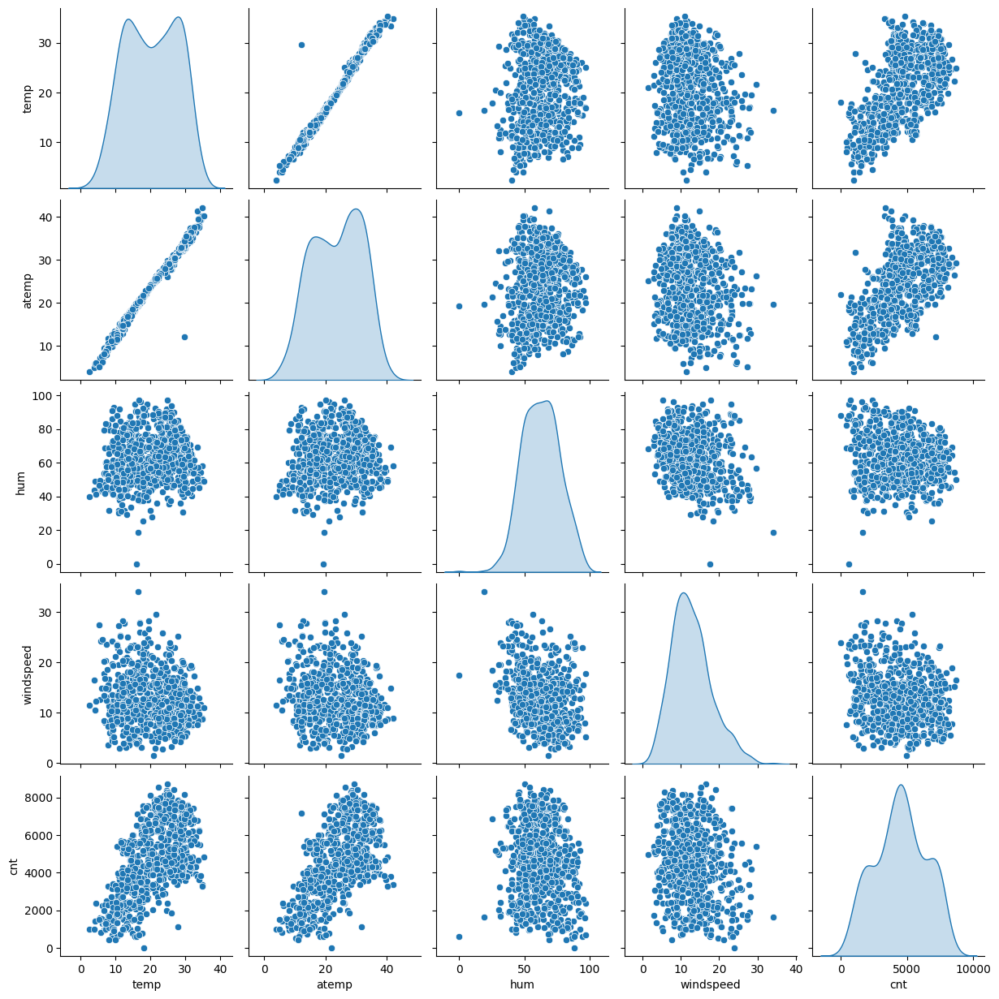
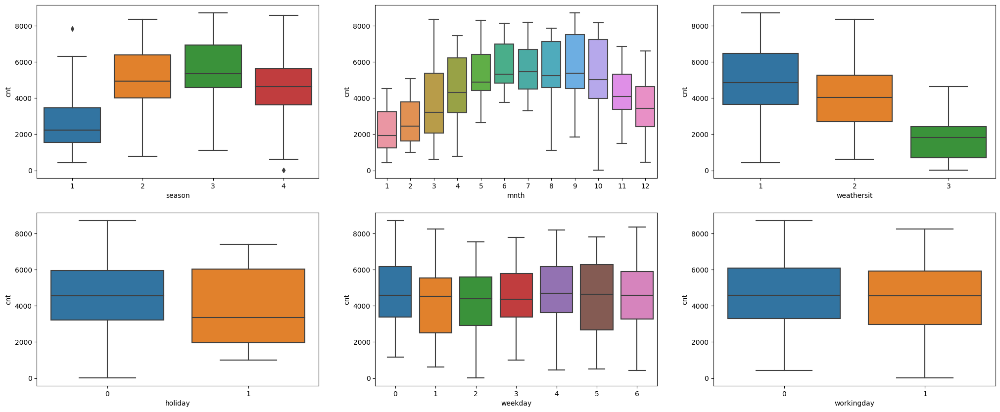
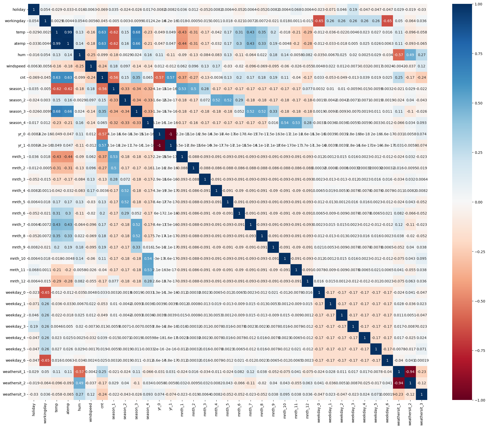
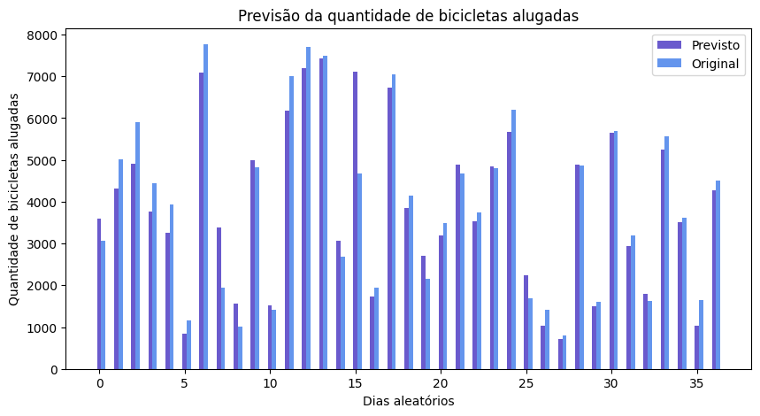

# 1 - Teoria

## 1.1 - Mínimos Quadrados

O **método dos Mínimos Quadrados(MMQ)** também conhecido como Mínimos Quadrados Ordinários é um modo de otimização na matemática e estatística. Este método procura melhorar um conjunto de dados tentando minimizar a soma dos quadrados das diferenças entre o valor estimado e os dados observados tal que essas diferenças são chamadas de resíduos, vamos demonstrar esse problema.

Temos um conjunto de dados simples que consiste em $n$ pontos (que são pares ordenados) $(x_i, y_i)$, $i= 1,2,.....,n$ tal que $x_i$ é uma variável independe e $y_i$ é uma dependente.

A função modelo dada como $F(x,b)$ tal que os parâmetros ajustáveis são mantidos no vetor $b$, queremos encontrar os parâmetros que melhor se ajusta em nos dados.

O ajuste de um modelo é pelo seu resíduo, que é diferença entre o valor real da variável dependente e o valor predito pelo modelo:

$$r_i = y_i - F(x_i,b)$$ 

Então, encontrar os valores ideais para os parâmetros, minimizando a soma S dos quadrados residuais :

$$ S = \sum\limits_{i-1}^{\mbox{}{n}}r^2_i$$

Um tipo de modelo de duas dimensões é o da reta da função afim:

$$ f(x) = b_0 + b_1x$$ 


$b_0$ sendo a intersecção em y e $b_1$ a inclinação.

## 1.2 - Regressão Linear

### 1.2.1 - Regressão Linear Simples

Em estatística ou econometria, a análise de regressão linear é usada para prever o valor de uma variável com base no valor de outra. A variável que deseja prever é chamada de **variável dependente**. A variável que é usada para prever o valor de outra variável é chamada de **variável independente**.

Em regressão simples, queremos estimar valores de determinada variável y. Para isso, consideramos os valores de outra variável x que acreditamos ter poder de explicação sobre y conforme a fórmulam:

$$ y = \alpha + \beta x + \epsilon$$

Tal que:

* $\alpha$ é o parâmetro do modelo chamado de constante (pois não depende de x).

* $\beta$ é o parâmetro do modelo chamado de coeficiente da variáve x.

* $\epsilon$ é o erro que representa a variação de y que não é explicada pelo modelo.

Em uma base de dados com $n$ valores observados de $y$ e $x$. Sabemos que usando base de dados $y$ e $x$ são vetores que representa uma lista de valores, um para cada observação de dados.

O método dos mínimos quadrados ajuda a encontrar as estimativas de $\alpha$ e $\beta$ . Como sabemos, serão somente estimativas desses parâmetros, pois o valor real dos parâmetros são desconhecidos.

 Logo, quando for fazer a estimativa iremos mudar a notação de algumas variáveis:

$$\alpha = a, \beta = b, \epsilon = e $$

Logo, quando estimamos um modelo a base de dados, estamos estimando :

$$y_i = a + bx_i + e_i$$  

Tal que $i$ indica uma das n observações da base de dados e $e$ vai ser chamado de resíduo ao invés de erro.

O método dos mínimos quadrados minimiza a soma dos quadrado dos resíduos, ou seja, minimiza:

$$\sum\limits_{t=0}^{\mbox{}{n}}e^2$$

A ideia dessa técnica é que, minimizando essa soma, encontraremos a e b que trarão menor diferença entre a previsão de $y$ e o $y$ realmente observado: 

Tomando $e_i = y_i - a -bx_i$, teremos 
$$ S(a,b) = \sum\limits_{t=0}^{\mbox{}{n}}(y_i - a -bx_i)^2$$

A minimização vai ser quando derivarmos S e relação a a e b, usando a regra da cadeia e depois igualando a zero. 

Assim chegaremos a: 

$$ b = (\sum \limits_{i=1}^{\mbox{}{n}}(x_i - x^*)(y_i - y^*))(\sum \limits_{i=1}^{\mbox{}{n}}(x_i - x^*)^2) $$ 


Tal que onde $y^*$ é a média amostral de y e $x^*$ é a média amostral de x. 

### 1.2.2 - Regressão Múltipla

A regressão múltipla apresenta um funcionamento parecido com o da regressão simples, porém, leva em consideração diversas variáveis explicativas x influenciando y ao mesmo tempo:

$$ y = b_0 + x_1b_1 + x_2b_2 + ... + x_kb_k + e$$
    
Ao usar uma base de dados com $k$ variáveis explicativas e $n$ observações, o modelo pode ser escrito de uma forma matricial, mas também pode ser resumida em fórmula como: 

$$ y = Xb + e $$ 

A técnica para mínimos quadrados continua sendo a mesma, logo tendo $e = y - Xb$ Temos:

$$S(b) = (y - Xb)^T (Y - Xb)$$ 

A minimização pode ser obtida ao derivar S e igualar a zero, logo teremos: 

$$b = (X^TX)^1X^Ty$$

## 1.3 - Exemplo simples

Abaixo, listamos apenas alguns dados de uma pesquisa americana sobre altura das pessoas, para que nossas contas não fiquem tão extensas.

| Altura  | Altura Mãe | Altura Pai|
|---------- | ----------  |---------- |
|152|155|165|
|162|155|160|
|165|170|173|
|170|163|183|
|173|168|183|
|183|165|183|


Quanto maior o número de dados, mais provável de o sistema ser impossível (podemos fazer a analogia geométrica de que por três pontos não colineares no espaço passa um único plano; se aumentarmos o número de pontos, mais difícil que haja um plano contendo todos eles).


\begin{equation*}
\begin{cases}
a\ +\ bx_{1} \ +\ cy_{1} \ =\ z_{1}\\
a+bx_{2} \ +\ cy_{2} \ =\ z_{2}\\
\vdots \\
a\ +\ bx_{k} \ +\ cy_{k} \ =\ z_{k}
\end{cases}\rightarrow \begin{bmatrix}
1 & x_{1} & y_{1}\\
1 & x_{2} & y_{2}\\
\vdots  & \vdots  & \vdots \\
1 & x_{k} & y_{k}
\end{bmatrix}\begin{bmatrix}
a\\
b\\
c
\end{bmatrix} =\begin{bmatrix}
z_{1}\\
z_{2}\\
\vdots \\
z_{k}
\end{bmatrix}
\end{equation*}

 Por isto, procuramos por uma solução de mínimos quadrados.


\begin{equation*}
A\vec{x} \ =\ \vec{b}\rightarrow \begin{bmatrix}
1 & 155 & 165\\
1 & 155 & 160\\
1 & 170 & 173\\
1 & 163 & 183\\
1 & 168 & 183\\
1 & 165 & 183
\end{bmatrix}\begin{bmatrix}
a\\
b\\
c
\end{bmatrix} =\begin{bmatrix}
152\\
162\\
165\\
170\\
173\\
183
\end{bmatrix}
\end{equation*}

Calculamos


\begin{equation*}
A^{T} A=\begin{bmatrix}
1 & 1 & 1 & 1 & 1 & 1\\
155 & 155 & 170 & 163 & 168 & 165\\
165 & 160 & 173 & 183 & 183 & 183
\end{bmatrix}\begin{bmatrix}
1 & 155 & 165\\
1 & 155 & 160\\
1 & 170 & 173\\
1 & 163 & 183\\
1 & 168 & 183\\
1 & 165 & 183
\end{bmatrix} =\begin{bmatrix}
6 & 976 & 1047\\
976 & 158968 & 170553\\
1047 & 170553 & 183221
\end{bmatrix}
\end{equation*}

e


\begin{equation*}
A^{T}\vec{b} =\begin{bmatrix}
1 & 1 & 1 & 1 & 1 & 1\\
155 & 155 & 170 & 163 & 168 & 165\\
165 & 160 & 173 & 183 & 183 & 183
\end{bmatrix}\begin{bmatrix}
152\\
162\\
165\\
170\\
173\\
183
\end{bmatrix} =\begin{bmatrix}
1005\\
163689\\
175803
\end{bmatrix}
\end{equation*}

Por escalonamento,


\begin{equation*}
\begin{bmatrix}
6 & 976 & 1047 & 1005\\
976 & 158968 & 170553 & 163689\\
1047 & 170553 & 183221 & 175803
\end{bmatrix}\rightarrow \begin{bmatrix}
1 & 0 & 0 & 14.781\\
0 & 1 & 0 & 0.099\\
0 & 0 & 1 & 0783
\end{bmatrix}
\end{equation*}

A equação de melhor ajuste procurada é, portanto, aproximadamente,


\begin{equation*}
z\ \simeq \ 14.781\ +\ 0.099x\ +\ 0.783y
\end{equation*}


# 2 - Aplicação

## 2.1 - Contexto e Objetivos

Um sistema de compartilhamento de bicicletas é um serviço no qual as bicicletas são disponibilizadas para uso compartilhado para indivíduos a curto prazo por um preço ou gratuitamente. Muitos sistemas de compartilhamento de bicicletas permitem que as pessoas peguem uma bicicleta emprestada de um "dock" que geralmente é controlado por computador, no qual o usuário insere as informações de pagamento e o sistema o desbloqueia. Esta bicicleta pode então ser devolvida a outra doca pertencente ao mesmo sistema.

Com base em várias pesquisas meteorológicas e estilos das pessoas, Queremos entender os fatores dos quais depende a demanda por essas bicicletas compartilhadas. Especificamente, queremos entender os fatores que afetam a demanda por essas bicicletas compartilhadas no mercado americano. 

**Objetivo do negócio:**

Somos obrigados a modelar a demanda por bicicletas compartilhadas com as variáveis ​​independentes disponíveis. Ele será usado para entender exatamente como as demandas variam com diferentes recursos. Esse modelo será útil para manipular a estratégia de negócios de acordo com os níveis de demanda e atender às expectativas do cliente. Além disso, o modelo será uma boa maneira de a administração entender a dinâmica da demanda de um novo mercado.

link: https://business-science.github.io/timetk/reference/bike_sharing_daily.html

## 2.2 - Importação e Limpeza dos dados


```python
import numpy as np
import pandas as pd
import matplotlib.pyplot as plt
import seaborn as sns
%matplotlib inline

from sklearn.model_selection import train_test_split
import statsmodels.api as sm
```


```python
bike = pd.DataFrame(pd.read_csv("day.csv"))
```


```python
bike
```


<div>
<style scoped>
    .dataframe tbody tr th:only-of-type {
        vertical-align: middle;
    }

    .dataframe tbody tr th {
        vertical-align: top;
    }

    .dataframe thead th {
        text-align: right;
    }
</style>
<table border="1" class="dataframe">
  <thead>
    <tr style="text-align: right;">
      <th></th>
      <th>instant</th>
      <th>dteday</th>
      <th>season</th>
      <th>yr</th>
      <th>mnth</th>
      <th>holiday</th>
      <th>weekday</th>
      <th>workingday</th>
      <th>weathersit</th>
      <th>temp</th>
      <th>atemp</th>
      <th>hum</th>
      <th>windspeed</th>
      <th>casual</th>
      <th>registered</th>
      <th>cnt</th>
    </tr>
  </thead>
  <tbody>
    <tr>
      <th>0</th>
      <td>1</td>
      <td>01-01-2018</td>
      <td>1</td>
      <td>0</td>
      <td>1</td>
      <td>0</td>
      <td>1</td>
      <td>1</td>
      <td>2</td>
      <td>14.110847</td>
      <td>18.18125</td>
      <td>80.5833</td>
      <td>10.749882</td>
      <td>331</td>
      <td>654</td>
      <td>985</td>
    </tr>
    <tr>
      <th>1</th>
      <td>2</td>
      <td>02-01-2018</td>
      <td>1</td>
      <td>0</td>
      <td>1</td>
      <td>0</td>
      <td>2</td>
      <td>1</td>
      <td>2</td>
      <td>14.902598</td>
      <td>17.68695</td>
      <td>69.6087</td>
      <td>16.652113</td>
      <td>131</td>
      <td>670</td>
      <td>801</td>
    </tr>
    <tr>
      <th>2</th>
      <td>3</td>
      <td>03-01-2018</td>
      <td>1</td>
      <td>0</td>
      <td>1</td>
      <td>0</td>
      <td>3</td>
      <td>1</td>
      <td>1</td>
      <td>8.050924</td>
      <td>9.47025</td>
      <td>43.7273</td>
      <td>16.636703</td>
      <td>120</td>
      <td>1229</td>
      <td>1349</td>
    </tr>
    <tr>
      <th>3</th>
      <td>4</td>
      <td>04-01-2018</td>
      <td>1</td>
      <td>0</td>
      <td>1</td>
      <td>0</td>
      <td>4</td>
      <td>1</td>
      <td>1</td>
      <td>8.200000</td>
      <td>10.60610</td>
      <td>59.0435</td>
      <td>10.739832</td>
      <td>108</td>
      <td>1454</td>
      <td>1562</td>
    </tr>
    <tr>
      <th>4</th>
      <td>5</td>
      <td>05-01-2018</td>
      <td>1</td>
      <td>0</td>
      <td>1</td>
      <td>0</td>
      <td>5</td>
      <td>1</td>
      <td>1</td>
      <td>9.305237</td>
      <td>11.46350</td>
      <td>43.6957</td>
      <td>12.522300</td>
      <td>82</td>
      <td>1518</td>
      <td>1600</td>
    </tr>
    <tr>
      <th>...</th>
      <td>...</td>
      <td>...</td>
      <td>...</td>
      <td>...</td>
      <td>...</td>
      <td>...</td>
      <td>...</td>
      <td>...</td>
      <td>...</td>
      <td>...</td>
      <td>...</td>
      <td>...</td>
      <td>...</td>
      <td>...</td>
      <td>...</td>
      <td>...</td>
    </tr>
    <tr>
      <th>725</th>
      <td>726</td>
      <td>27-12-2019</td>
      <td>1</td>
      <td>1</td>
      <td>12</td>
      <td>0</td>
      <td>5</td>
      <td>1</td>
      <td>2</td>
      <td>10.420847</td>
      <td>11.33210</td>
      <td>65.2917</td>
      <td>23.458911</td>
      <td>247</td>
      <td>1867</td>
      <td>2114</td>
    </tr>
    <tr>
      <th>726</th>
      <td>727</td>
      <td>28-12-2019</td>
      <td>1</td>
      <td>1</td>
      <td>12</td>
      <td>0</td>
      <td>6</td>
      <td>0</td>
      <td>2</td>
      <td>10.386653</td>
      <td>12.75230</td>
      <td>59.0000</td>
      <td>10.416557</td>
      <td>644</td>
      <td>2451</td>
      <td>3095</td>
    </tr>
    <tr>
      <th>727</th>
      <td>728</td>
      <td>29-12-2019</td>
      <td>1</td>
      <td>1</td>
      <td>12</td>
      <td>0</td>
      <td>0</td>
      <td>0</td>
      <td>2</td>
      <td>10.386653</td>
      <td>12.12000</td>
      <td>75.2917</td>
      <td>8.333661</td>
      <td>159</td>
      <td>1182</td>
      <td>1341</td>
    </tr>
    <tr>
      <th>728</th>
      <td>729</td>
      <td>30-12-2019</td>
      <td>1</td>
      <td>1</td>
      <td>12</td>
      <td>0</td>
      <td>1</td>
      <td>1</td>
      <td>1</td>
      <td>10.489153</td>
      <td>11.58500</td>
      <td>48.3333</td>
      <td>23.500518</td>
      <td>364</td>
      <td>1432</td>
      <td>1796</td>
    </tr>
    <tr>
      <th>729</th>
      <td>730</td>
      <td>31-12-2019</td>
      <td>1</td>
      <td>1</td>
      <td>12</td>
      <td>0</td>
      <td>2</td>
      <td>1</td>
      <td>2</td>
      <td>8.849153</td>
      <td>11.17435</td>
      <td>57.7500</td>
      <td>10.374682</td>
      <td>439</td>
      <td>2290</td>
      <td>2729</td>
    </tr>
  </tbody>
</table>
<p>730 rows × 16 columns</p>
</div>


### Verificar as informações do dataframe 


```python
bike.info()
```

    <class 'pandas.core.frame.DataFrame'>
    RangeIndex: 730 entries, 0 to 729
    Data columns (total 16 columns):
     #   Column      Non-Null Count  Dtype  
    ---  ------      --------------  -----  
     0   instant     730 non-null    int64  
     1   dteday      730 non-null    object 
     2   season      730 non-null    int64  
     3   yr          730 non-null    int64  
     4   mnth        730 non-null    int64  
     5   holiday     730 non-null    int64  
     6   weekday     730 non-null    int64  
     7   workingday  730 non-null    int64  
     8   weathersit  730 non-null    int64  
     9   temp        730 non-null    float64
     10  atemp       730 non-null    float64
     11  hum         730 non-null    float64
     12  windspeed   730 non-null    float64
     13  casual      730 non-null    int64  
     14  registered  730 non-null    int64  
     15  cnt         730 non-null    int64  
    dtypes: float64(4), int64(11), object(1)
    memory usage: 91.4+ KB
    

#### Explicando as variáveis:

* **instant**: index do DataBase (type: int).

* **dteday**: Dia (type: Data).

* **season**: Estação do ano, sendo 1, 2, 3 e 4 index para, respectivamente, inverno, primavera, verão e outono. (type: int)

* **yr**: Ano, sendo 1 o ano de 2018 e 2 para o ano de 2019. (type: int)
 
* **mnth**: O mês do ano. (type: int).

* **holiday**: 1 para feriados e 0 para dias comuns. (type: int).

* **weekday**: index para os dias da semana, começando no domingo com o index 0. (type: int)

* **workingday**: se o dia não for fim de semana nem feriado for 1, caso contrário será 0.

* **weathersit**:  

 * 1: Claro, Poucas nuvens, Parcialmente nublado, Parcialmente nublado 

 * 2: Névoa + Nublado, Névoa + Nuvens quebradas, Névoa + Poucas nuvens, Névoa

 * 3: Neve fraca, Chuva fraca + Trovoada + Nuvens dispersas, Chuva fraca + Nuvens dispersas

 * 4: Chuva Pesada + Paletes de Gelo + Trovoada + Névoa, Neve + Neblina  (type: int)

* **temp**: Temperatura normalizada em Celsius. Os valores são derivados via (t-t_min)/(t_max-t_min), t_min=-8, t_max=+39 (somente em escala horária). (type: int).

* **atemp**: Temperatura de sensação normalizada em Celsius. Os valores são derivados via (t-t_min)/(t_max-t_min), t_min=-16, t_max=+50 (somente em escala horária). (type: int).

* **hum**: Umidade normalizada. Os valores são divididos em 100 (máx.). (type: int).

* **windspeed**: velocidade do vento normalizada. Os valores são divididos em 67 (máx.). (type: int).

* **casual**: contagem de usuários casuais. (type: int).

* **registered**: contagem de usuários registrados. (type: int).

* **cnt**: contagem do total de bicicletas alugadas, incluindo casuais e registradas. (type: int).


```python
bike.describe()
```


<div>
<style scoped>
    .dataframe tbody tr th:only-of-type {
        vertical-align: middle;
    }

    .dataframe tbody tr th {
        vertical-align: top;
    }

    .dataframe thead th {
        text-align: right;
    }
</style>
<table border="1" class="dataframe">
  <thead>
    <tr style="text-align: right;">
      <th></th>
      <th>instant</th>
      <th>season</th>
      <th>yr</th>
      <th>mnth</th>
      <th>holiday</th>
      <th>weekday</th>
      <th>workingday</th>
      <th>weathersit</th>
      <th>temp</th>
      <th>atemp</th>
      <th>hum</th>
      <th>windspeed</th>
      <th>casual</th>
      <th>registered</th>
      <th>cnt</th>
    </tr>
  </thead>
  <tbody>
    <tr>
      <th>count</th>
      <td>730.000000</td>
      <td>730.000000</td>
      <td>730.000000</td>
      <td>730.000000</td>
      <td>730.000000</td>
      <td>730.000000</td>
      <td>730.000000</td>
      <td>730.000000</td>
      <td>730.000000</td>
      <td>730.000000</td>
      <td>730.000000</td>
      <td>730.000000</td>
      <td>730.000000</td>
      <td>730.000000</td>
      <td>730.000000</td>
    </tr>
    <tr>
      <th>mean</th>
      <td>365.500000</td>
      <td>2.498630</td>
      <td>0.500000</td>
      <td>6.526027</td>
      <td>0.028767</td>
      <td>2.995890</td>
      <td>0.715068</td>
      <td>1.394521</td>
      <td>20.319259</td>
      <td>23.726322</td>
      <td>62.765175</td>
      <td>12.763620</td>
      <td>849.249315</td>
      <td>3658.757534</td>
      <td>4508.006849</td>
    </tr>
    <tr>
      <th>std</th>
      <td>210.877136</td>
      <td>1.110184</td>
      <td>0.500343</td>
      <td>3.450215</td>
      <td>0.167266</td>
      <td>2.000339</td>
      <td>0.451691</td>
      <td>0.544807</td>
      <td>7.506729</td>
      <td>8.150308</td>
      <td>14.237589</td>
      <td>5.195841</td>
      <td>686.479875</td>
      <td>1559.758728</td>
      <td>1936.011647</td>
    </tr>
    <tr>
      <th>min</th>
      <td>1.000000</td>
      <td>1.000000</td>
      <td>0.000000</td>
      <td>1.000000</td>
      <td>0.000000</td>
      <td>0.000000</td>
      <td>0.000000</td>
      <td>1.000000</td>
      <td>2.424346</td>
      <td>3.953480</td>
      <td>0.000000</td>
      <td>1.500244</td>
      <td>2.000000</td>
      <td>20.000000</td>
      <td>22.000000</td>
    </tr>
    <tr>
      <th>25%</th>
      <td>183.250000</td>
      <td>2.000000</td>
      <td>0.000000</td>
      <td>4.000000</td>
      <td>0.000000</td>
      <td>1.000000</td>
      <td>0.000000</td>
      <td>1.000000</td>
      <td>13.811885</td>
      <td>16.889713</td>
      <td>52.000000</td>
      <td>9.041650</td>
      <td>316.250000</td>
      <td>2502.250000</td>
      <td>3169.750000</td>
    </tr>
    <tr>
      <th>50%</th>
      <td>365.500000</td>
      <td>3.000000</td>
      <td>0.500000</td>
      <td>7.000000</td>
      <td>0.000000</td>
      <td>3.000000</td>
      <td>1.000000</td>
      <td>1.000000</td>
      <td>20.465826</td>
      <td>24.368225</td>
      <td>62.625000</td>
      <td>12.125325</td>
      <td>717.000000</td>
      <td>3664.500000</td>
      <td>4548.500000</td>
    </tr>
    <tr>
      <th>75%</th>
      <td>547.750000</td>
      <td>3.000000</td>
      <td>1.000000</td>
      <td>10.000000</td>
      <td>0.000000</td>
      <td>5.000000</td>
      <td>1.000000</td>
      <td>2.000000</td>
      <td>26.880615</td>
      <td>30.445775</td>
      <td>72.989575</td>
      <td>15.625589</td>
      <td>1096.500000</td>
      <td>4783.250000</td>
      <td>5966.000000</td>
    </tr>
    <tr>
      <th>max</th>
      <td>730.000000</td>
      <td>4.000000</td>
      <td>1.000000</td>
      <td>12.000000</td>
      <td>1.000000</td>
      <td>6.000000</td>
      <td>1.000000</td>
      <td>3.000000</td>
      <td>35.328347</td>
      <td>42.044800</td>
      <td>97.250000</td>
      <td>34.000021</td>
      <td>3410.000000</td>
      <td>6946.000000</td>
      <td>8714.000000</td>
    </tr>
  </tbody>
</table>
</div>


```python
#Quantidade de valores nulos

na = bike[bike.isna()].count()
print(na)
```

    instant       0
    dteday        0
    season        0
    yr            0
    mnth          0
    holiday       0
    weekday       0
    workingday    0
    weathersit    0
    temp          0
    atemp         0
    hum           0
    windspeed     0
    casual        0
    registered    0
    cnt           0
    dtype: int64
    

#### Análise das informações encontradas:

* Há 730 instâncias e 16 variáveis
* Não há valores NaN no nosso banco de dados
* 11 variáveis int, 4 float e 1 data, sendo que 'mnth', 'weekday', 'season' e 'weathersit' são variáveis categóricas.

#### Como essa variáveis são categóricas, vamos mudar o seu tipo:


```python
bike['yr'] = bike['yr'].astype('category')
bike['season'] = bike['season'].astype('category')
bike['weathersit'] = bike['weathersit'].astype('category')
bike['mnth'] = bike['mnth'].astype('category')
bike['weekday'] = bike['weekday'].astype('category')
```


```python
bike.info()
```

    <class 'pandas.core.frame.DataFrame'>
    RangeIndex: 730 entries, 0 to 729
    Data columns (total 16 columns):
     #   Column      Non-Null Count  Dtype   
    ---  ------      --------------  -----   
     0   instant     730 non-null    int64   
     1   dteday      730 non-null    object  
     2   season      730 non-null    category
     3   yr          730 non-null    category
     4   mnth        730 non-null    category
     5   holiday     730 non-null    int64   
     6   weekday     730 non-null    category
     7   workingday  730 non-null    int64   
     8   weathersit  730 non-null    category
     9   temp        730 non-null    float64 
     10  atemp       730 non-null    float64 
     11  hum         730 non-null    float64 
     12  windspeed   730 non-null    float64 
     13  casual      730 non-null    int64   
     14  registered  730 non-null    int64   
     15  cnt         730 non-null    int64   
    dtypes: category(5), float64(4), int64(6), object(1)
    memory usage: 67.6+ KB
    

#### Vamos excluir as seguintes variáveis:

* **instant** : É apenas um valor de índice.

* **dteday** : Já temos essa variáveis separada em outras variáveis.

* **casual & registered** : ambas as colunas contêm a contagem de bicicletas reservadas por diferentes categorias de clientes. Como nosso objetivo é encontrar a contagem total de bicicletas e não por categoria específica, vamos ignorar essas duas colunas.


```python
bike_new = bike[['season', 'yr', 'mnth', 'holiday', 'weekday',
       'workingday', 'weathersit', 'temp', 'atemp', 'hum', 'windspeed',
       'cnt']]
bike_new
```


<div>
<style scoped>
    .dataframe tbody tr th:only-of-type {
        vertical-align: middle;
    }

    .dataframe tbody tr th {
        vertical-align: top;
    }

    .dataframe thead th {
        text-align: right;
    }
</style>
<table border="1" class="dataframe">
  <thead>
    <tr style="text-align: right;">
      <th></th>
      <th>season</th>
      <th>yr</th>
      <th>mnth</th>
      <th>holiday</th>
      <th>weekday</th>
      <th>workingday</th>
      <th>weathersit</th>
      <th>temp</th>
      <th>atemp</th>
      <th>hum</th>
      <th>windspeed</th>
      <th>cnt</th>
    </tr>
  </thead>
  <tbody>
    <tr>
      <th>0</th>
      <td>1</td>
      <td>0</td>
      <td>1</td>
      <td>0</td>
      <td>1</td>
      <td>1</td>
      <td>2</td>
      <td>14.110847</td>
      <td>18.18125</td>
      <td>80.5833</td>
      <td>10.749882</td>
      <td>985</td>
    </tr>
    <tr>
      <th>1</th>
      <td>1</td>
      <td>0</td>
      <td>1</td>
      <td>0</td>
      <td>2</td>
      <td>1</td>
      <td>2</td>
      <td>14.902598</td>
      <td>17.68695</td>
      <td>69.6087</td>
      <td>16.652113</td>
      <td>801</td>
    </tr>
    <tr>
      <th>2</th>
      <td>1</td>
      <td>0</td>
      <td>1</td>
      <td>0</td>
      <td>3</td>
      <td>1</td>
      <td>1</td>
      <td>8.050924</td>
      <td>9.47025</td>
      <td>43.7273</td>
      <td>16.636703</td>
      <td>1349</td>
    </tr>
    <tr>
      <th>3</th>
      <td>1</td>
      <td>0</td>
      <td>1</td>
      <td>0</td>
      <td>4</td>
      <td>1</td>
      <td>1</td>
      <td>8.200000</td>
      <td>10.60610</td>
      <td>59.0435</td>
      <td>10.739832</td>
      <td>1562</td>
    </tr>
    <tr>
      <th>4</th>
      <td>1</td>
      <td>0</td>
      <td>1</td>
      <td>0</td>
      <td>5</td>
      <td>1</td>
      <td>1</td>
      <td>9.305237</td>
      <td>11.46350</td>
      <td>43.6957</td>
      <td>12.522300</td>
      <td>1600</td>
    </tr>
    <tr>
      <th>...</th>
      <td>...</td>
      <td>...</td>
      <td>...</td>
      <td>...</td>
      <td>...</td>
      <td>...</td>
      <td>...</td>
      <td>...</td>
      <td>...</td>
      <td>...</td>
      <td>...</td>
      <td>...</td>
    </tr>
    <tr>
      <th>725</th>
      <td>1</td>
      <td>1</td>
      <td>12</td>
      <td>0</td>
      <td>5</td>
      <td>1</td>
      <td>2</td>
      <td>10.420847</td>
      <td>11.33210</td>
      <td>65.2917</td>
      <td>23.458911</td>
      <td>2114</td>
    </tr>
    <tr>
      <th>726</th>
      <td>1</td>
      <td>1</td>
      <td>12</td>
      <td>0</td>
      <td>6</td>
      <td>0</td>
      <td>2</td>
      <td>10.386653</td>
      <td>12.75230</td>
      <td>59.0000</td>
      <td>10.416557</td>
      <td>3095</td>
    </tr>
    <tr>
      <th>727</th>
      <td>1</td>
      <td>1</td>
      <td>12</td>
      <td>0</td>
      <td>0</td>
      <td>0</td>
      <td>2</td>
      <td>10.386653</td>
      <td>12.12000</td>
      <td>75.2917</td>
      <td>8.333661</td>
      <td>1341</td>
    </tr>
    <tr>
      <th>728</th>
      <td>1</td>
      <td>1</td>
      <td>12</td>
      <td>0</td>
      <td>1</td>
      <td>1</td>
      <td>1</td>
      <td>10.489153</td>
      <td>11.58500</td>
      <td>48.3333</td>
      <td>23.500518</td>
      <td>1796</td>
    </tr>
    <tr>
      <th>729</th>
      <td>1</td>
      <td>1</td>
      <td>12</td>
      <td>0</td>
      <td>2</td>
      <td>1</td>
      <td>2</td>
      <td>8.849153</td>
      <td>11.17435</td>
      <td>57.7500</td>
      <td>10.374682</td>
      <td>2729</td>
    </tr>
  </tbody>
</table>
<p>730 rows × 12 columns</p>
</div>


### Criando variáveis ficticías 

As variáveis categorias não podem ser utilizadas em forma de texto, uma vez que os algoritmos compreendem apenas valores numéricos. Também não podemos simplesmente atribuir um valor numérico para cada categoria, uma vez que esse processo, conhecido como ponderação arbitrária, pode criar uma ordenação e pesos para as categorias que não refletem a realidade.

O processo correto de transformação das variáveis categóricas é feito a partir da criação de novas colunas a partir das categorias. Cada uma delas se torna uma nova coluna e o valor na linha correspondente será 1, caso tenha a presença da característica. Do contrário, será 0. Esse processo é conhecido como codificação **"one-hot"**.

| Variável   | 
|---------- |
| Característica 1 | 
| Característica 2  |   
| Característica 3  |   

| Característica 1   | Característica 2 | Característica 3|
|---------- | ----------  |---------- |
|**1** | 0 | 0| 
| 0  |  **1** | 0| 
| 0  |  0 | **1**| 


```python
bike_new = pd.get_dummies(bike_new)
bike_new.info()
```

    <class 'pandas.core.frame.DataFrame'>
    RangeIndex: 730 entries, 0 to 729
    Data columns (total 35 columns):
     #   Column        Non-Null Count  Dtype  
    ---  ------        --------------  -----  
     0   holiday       730 non-null    int64  
     1   workingday    730 non-null    int64  
     2   temp          730 non-null    float64
     3   atemp         730 non-null    float64
     4   hum           730 non-null    float64
     5   windspeed     730 non-null    float64
     6   cnt           730 non-null    int64  
     7   season_1      730 non-null    uint8  
     8   season_2      730 non-null    uint8  
     9   season_3      730 non-null    uint8  
     10  season_4      730 non-null    uint8  
     11  yr_0          730 non-null    uint8  
     12  yr_1          730 non-null    uint8  
     13  mnth_1        730 non-null    uint8  
     14  mnth_2        730 non-null    uint8  
     15  mnth_3        730 non-null    uint8  
     16  mnth_4        730 non-null    uint8  
     17  mnth_5        730 non-null    uint8  
     18  mnth_6        730 non-null    uint8  
     19  mnth_7        730 non-null    uint8  
     20  mnth_8        730 non-null    uint8  
     21  mnth_9        730 non-null    uint8  
     22  mnth_10       730 non-null    uint8  
     23  mnth_11       730 non-null    uint8  
     24  mnth_12       730 non-null    uint8  
     25  weekday_0     730 non-null    uint8  
     26  weekday_1     730 non-null    uint8  
     27  weekday_2     730 non-null    uint8  
     28  weekday_3     730 non-null    uint8  
     29  weekday_4     730 non-null    uint8  
     30  weekday_5     730 non-null    uint8  
     31  weekday_6     730 non-null    uint8  
     32  weathersit_1  730 non-null    uint8  
     33  weathersit_2  730 non-null    uint8  
     34  weathersit_3  730 non-null    uint8  
    dtypes: float64(4), int64(3), uint8(28)
    memory usage: 60.0 KB
    


```python
bike_new
```


<div>
<style scoped>
    .dataframe tbody tr th:only-of-type {
        vertical-align: middle;
    }

    .dataframe tbody tr th {
        vertical-align: top;
    }

    .dataframe thead th {
        text-align: right;
    }
</style>
<table border="1" class="dataframe">
  <thead>
    <tr style="text-align: right;">
      <th></th>
      <th>holiday</th>
      <th>workingday</th>
      <th>temp</th>
      <th>atemp</th>
      <th>hum</th>
      <th>windspeed</th>
      <th>cnt</th>
      <th>season_1</th>
      <th>season_2</th>
      <th>season_3</th>
      <th>...</th>
      <th>weekday_0</th>
      <th>weekday_1</th>
      <th>weekday_2</th>
      <th>weekday_3</th>
      <th>weekday_4</th>
      <th>weekday_5</th>
      <th>weekday_6</th>
      <th>weathersit_1</th>
      <th>weathersit_2</th>
      <th>weathersit_3</th>
    </tr>
  </thead>
  <tbody>
    <tr>
      <th>0</th>
      <td>0</td>
      <td>1</td>
      <td>14.110847</td>
      <td>18.18125</td>
      <td>80.5833</td>
      <td>10.749882</td>
      <td>985</td>
      <td>1</td>
      <td>0</td>
      <td>0</td>
      <td>...</td>
      <td>0</td>
      <td>1</td>
      <td>0</td>
      <td>0</td>
      <td>0</td>
      <td>0</td>
      <td>0</td>
      <td>0</td>
      <td>1</td>
      <td>0</td>
    </tr>
    <tr>
      <th>1</th>
      <td>0</td>
      <td>1</td>
      <td>14.902598</td>
      <td>17.68695</td>
      <td>69.6087</td>
      <td>16.652113</td>
      <td>801</td>
      <td>1</td>
      <td>0</td>
      <td>0</td>
      <td>...</td>
      <td>0</td>
      <td>0</td>
      <td>1</td>
      <td>0</td>
      <td>0</td>
      <td>0</td>
      <td>0</td>
      <td>0</td>
      <td>1</td>
      <td>0</td>
    </tr>
    <tr>
      <th>2</th>
      <td>0</td>
      <td>1</td>
      <td>8.050924</td>
      <td>9.47025</td>
      <td>43.7273</td>
      <td>16.636703</td>
      <td>1349</td>
      <td>1</td>
      <td>0</td>
      <td>0</td>
      <td>...</td>
      <td>0</td>
      <td>0</td>
      <td>0</td>
      <td>1</td>
      <td>0</td>
      <td>0</td>
      <td>0</td>
      <td>1</td>
      <td>0</td>
      <td>0</td>
    </tr>
    <tr>
      <th>3</th>
      <td>0</td>
      <td>1</td>
      <td>8.200000</td>
      <td>10.60610</td>
      <td>59.0435</td>
      <td>10.739832</td>
      <td>1562</td>
      <td>1</td>
      <td>0</td>
      <td>0</td>
      <td>...</td>
      <td>0</td>
      <td>0</td>
      <td>0</td>
      <td>0</td>
      <td>1</td>
      <td>0</td>
      <td>0</td>
      <td>1</td>
      <td>0</td>
      <td>0</td>
    </tr>
    <tr>
      <th>4</th>
      <td>0</td>
      <td>1</td>
      <td>9.305237</td>
      <td>11.46350</td>
      <td>43.6957</td>
      <td>12.522300</td>
      <td>1600</td>
      <td>1</td>
      <td>0</td>
      <td>0</td>
      <td>...</td>
      <td>0</td>
      <td>0</td>
      <td>0</td>
      <td>0</td>
      <td>0</td>
      <td>1</td>
      <td>0</td>
      <td>1</td>
      <td>0</td>
      <td>0</td>
    </tr>
    <tr>
      <th>...</th>
      <td>...</td>
      <td>...</td>
      <td>...</td>
      <td>...</td>
      <td>...</td>
      <td>...</td>
      <td>...</td>
      <td>...</td>
      <td>...</td>
      <td>...</td>
      <td>...</td>
      <td>...</td>
      <td>...</td>
      <td>...</td>
      <td>...</td>
      <td>...</td>
      <td>...</td>
      <td>...</td>
      <td>...</td>
      <td>...</td>
      <td>...</td>
    </tr>
    <tr>
      <th>725</th>
      <td>0</td>
      <td>1</td>
      <td>10.420847</td>
      <td>11.33210</td>
      <td>65.2917</td>
      <td>23.458911</td>
      <td>2114</td>
      <td>1</td>
      <td>0</td>
      <td>0</td>
      <td>...</td>
      <td>0</td>
      <td>0</td>
      <td>0</td>
      <td>0</td>
      <td>0</td>
      <td>1</td>
      <td>0</td>
      <td>0</td>
      <td>1</td>
      <td>0</td>
    </tr>
    <tr>
      <th>726</th>
      <td>0</td>
      <td>0</td>
      <td>10.386653</td>
      <td>12.75230</td>
      <td>59.0000</td>
      <td>10.416557</td>
      <td>3095</td>
      <td>1</td>
      <td>0</td>
      <td>0</td>
      <td>...</td>
      <td>0</td>
      <td>0</td>
      <td>0</td>
      <td>0</td>
      <td>0</td>
      <td>0</td>
      <td>1</td>
      <td>0</td>
      <td>1</td>
      <td>0</td>
    </tr>
    <tr>
      <th>727</th>
      <td>0</td>
      <td>0</td>
      <td>10.386653</td>
      <td>12.12000</td>
      <td>75.2917</td>
      <td>8.333661</td>
      <td>1341</td>
      <td>1</td>
      <td>0</td>
      <td>0</td>
      <td>...</td>
      <td>1</td>
      <td>0</td>
      <td>0</td>
      <td>0</td>
      <td>0</td>
      <td>0</td>
      <td>0</td>
      <td>0</td>
      <td>1</td>
      <td>0</td>
    </tr>
    <tr>
      <th>728</th>
      <td>0</td>
      <td>1</td>
      <td>10.489153</td>
      <td>11.58500</td>
      <td>48.3333</td>
      <td>23.500518</td>
      <td>1796</td>
      <td>1</td>
      <td>0</td>
      <td>0</td>
      <td>...</td>
      <td>0</td>
      <td>1</td>
      <td>0</td>
      <td>0</td>
      <td>0</td>
      <td>0</td>
      <td>0</td>
      <td>1</td>
      <td>0</td>
      <td>0</td>
    </tr>
    <tr>
      <th>729</th>
      <td>0</td>
      <td>1</td>
      <td>8.849153</td>
      <td>11.17435</td>
      <td>57.7500</td>
      <td>10.374682</td>
      <td>2729</td>
      <td>1</td>
      <td>0</td>
      <td>0</td>
      <td>...</td>
      <td>0</td>
      <td>0</td>
      <td>1</td>
      <td>0</td>
      <td>0</td>
      <td>0</td>
      <td>0</td>
      <td>0</td>
      <td>1</td>
      <td>0</td>
    </tr>
  </tbody>
</table>
<p>730 rows × 35 columns</p>
</div>


### Tranformação logarítimica

#### Tranformação das variáveis numéricas em logarítimos na base 10

**Primeira**: Supondo que a distribuição da variável em questão possui um viés, ou seja, uma das extremidades elevadas e uma cauda longa, medidas como correlação ou regressão podem ser bastante influenciadas pelo pico da distribuição, outliers, dentre outros. A aplicação da transformação pode reduzir o efeito do viés.

 **Segunda** : Alguns conceitos são melhor compreendidos quando tratamos sobre a proporção dos objetos do que sobre a diferença entre eles.


```python

```

## 3 - Verificando Correlações

### 3.1 - Variáveis numéricas 

Vamos fazer um gráfico de pares de todas as variáveis numéricas.


```python
# Cria um novo dataframe apenas com variáveis numéricas:

bike_num = bike_new[[ 'temp', 'atemp', 'hum', 'windspeed','cnt']]

sns.pairplot(bike_num, diag_kind='kde')
plt.show()
```


    

    


O Par-Plot acima indica que existe uma RELAÇÃO LINEAR entre 'temp', 'atemp' e 'cnt'

### 3.2 - Variáveis Categóricas

Construir boxplot de todas as variáveis categóricas (antes de criar dummies) contra a variável alvo 'cnt'.

Para ver como cada variável preditora se compara à variável de destino.


```python
plt.figure(figsize=(25, 10))
plt.subplot(2,3,1)
sns.boxplot(x = 'season', y = 'cnt', data = bike)
plt.subplot(2,3,2)
sns.boxplot(x = 'mnth', y = 'cnt', data = bike)
plt.subplot(2,3,3)
sns.boxplot(x = 'weathersit', y = 'cnt', data = bike)
plt.subplot(2,3,4)
sns.boxplot(x = 'holiday', y = 'cnt', data = bike)
plt.subplot(2,3,5)
sns.boxplot(x = 'weekday', y = 'cnt', data = bike)
plt.subplot(2,3,6)
sns.boxplot(x = 'workingday', y = 'cnt', data = bike)
plt.show()
```


    

    


**mnth**: Quase 10% das reservas de bicicletas aconteceram nos meses 5,6,7,8 e 9, com uma média de mais de 4.000 reservas por mês. Isso indica que mnth tem alguma tendência para reservas e pode ser um bom preditor para a variável dependente.

**weathersit**: Quase 67% das reservas de bicicletas estavam acontecendo durante o "weathersit1", com uma média de cerca de 5.000 reservas (para o período de 2 anos). Isto foi seguido por weathersit2 com 30% da reserva total. Isso indica que o clima mostra alguma tendência em relação às reservas de bicicletas pode ser um bom preditor para a variável dependente.

**holiday**: Quase 97,6% das reservas de bicicletas ocorreram quando não é feriado, o que significa que esses dados são claramente tendenciosos. **Isso indica que o feriado NÃO PODE ser um bom preditor para a variável dependente**.

**weekday**: a variável dia da semana apresenta tendência muito próxima (entre 13,5%-14,8% do total de reservas em todos os dias da semana) tendo suas medianas independentes entre 4.000 a 5.000 reservas. Esta variável pode ter alguma ou nenhuma influência sobre o preditor.

**workingday**: Quase 69% das reservas de bicicletas ocorreram em 'dia útil' com uma mediana de cerca de 5.000 reservas (para o período de 2 anos). Isso indica que a jornada de trabalho pode ser um bom preditor para a variável dependente.

### 3.3 -  Matriz de correlação

Vamos verificar os coeficientes de correlação para ver quais variáveis são altamente correlacionadas.


```python
plt.figure(figsize = (25,20))
sns.heatmap(bike_new.corr(), annot = True, cmap="RdBu")
plt.show()
```


    

    


O mapa de calor mostra claramente quais variáveis são multicolineares por natureza e quais têm alta colinearidade com a variável alvo.

Iremos referenciar este mapa para frente e para trás durante a construção do modelo linear para validar diferentes valores correlacionados junto com VIF & valor p, para identificar a variável correta para selecionar/eliminar do modelo.


```python
bike_new.drop(["holiday"], axis=1, inplace = True)
```


```python
bike_new
```


<div>
<style scoped>
    .dataframe tbody tr th:only-of-type {
        vertical-align: middle;
    }

    .dataframe tbody tr th {
        vertical-align: top;
    }

    .dataframe thead th {
        text-align: right;
    }
</style>
<table border="1" class="dataframe">
  <thead>
    <tr style="text-align: right;">
      <th></th>
      <th>workingday</th>
      <th>temp</th>
      <th>atemp</th>
      <th>hum</th>
      <th>windspeed</th>
      <th>cnt</th>
      <th>season_1</th>
      <th>season_2</th>
      <th>season_3</th>
      <th>season_4</th>
      <th>...</th>
      <th>weekday_0</th>
      <th>weekday_1</th>
      <th>weekday_2</th>
      <th>weekday_3</th>
      <th>weekday_4</th>
      <th>weekday_5</th>
      <th>weekday_6</th>
      <th>weathersit_1</th>
      <th>weathersit_2</th>
      <th>weathersit_3</th>
    </tr>
  </thead>
  <tbody>
    <tr>
      <th>0</th>
      <td>1</td>
      <td>14.110847</td>
      <td>18.18125</td>
      <td>80.5833</td>
      <td>10.749882</td>
      <td>985</td>
      <td>1</td>
      <td>0</td>
      <td>0</td>
      <td>0</td>
      <td>...</td>
      <td>0</td>
      <td>1</td>
      <td>0</td>
      <td>0</td>
      <td>0</td>
      <td>0</td>
      <td>0</td>
      <td>0</td>
      <td>1</td>
      <td>0</td>
    </tr>
    <tr>
      <th>1</th>
      <td>1</td>
      <td>14.902598</td>
      <td>17.68695</td>
      <td>69.6087</td>
      <td>16.652113</td>
      <td>801</td>
      <td>1</td>
      <td>0</td>
      <td>0</td>
      <td>0</td>
      <td>...</td>
      <td>0</td>
      <td>0</td>
      <td>1</td>
      <td>0</td>
      <td>0</td>
      <td>0</td>
      <td>0</td>
      <td>0</td>
      <td>1</td>
      <td>0</td>
    </tr>
    <tr>
      <th>2</th>
      <td>1</td>
      <td>8.050924</td>
      <td>9.47025</td>
      <td>43.7273</td>
      <td>16.636703</td>
      <td>1349</td>
      <td>1</td>
      <td>0</td>
      <td>0</td>
      <td>0</td>
      <td>...</td>
      <td>0</td>
      <td>0</td>
      <td>0</td>
      <td>1</td>
      <td>0</td>
      <td>0</td>
      <td>0</td>
      <td>1</td>
      <td>0</td>
      <td>0</td>
    </tr>
    <tr>
      <th>3</th>
      <td>1</td>
      <td>8.200000</td>
      <td>10.60610</td>
      <td>59.0435</td>
      <td>10.739832</td>
      <td>1562</td>
      <td>1</td>
      <td>0</td>
      <td>0</td>
      <td>0</td>
      <td>...</td>
      <td>0</td>
      <td>0</td>
      <td>0</td>
      <td>0</td>
      <td>1</td>
      <td>0</td>
      <td>0</td>
      <td>1</td>
      <td>0</td>
      <td>0</td>
    </tr>
    <tr>
      <th>4</th>
      <td>1</td>
      <td>9.305237</td>
      <td>11.46350</td>
      <td>43.6957</td>
      <td>12.522300</td>
      <td>1600</td>
      <td>1</td>
      <td>0</td>
      <td>0</td>
      <td>0</td>
      <td>...</td>
      <td>0</td>
      <td>0</td>
      <td>0</td>
      <td>0</td>
      <td>0</td>
      <td>1</td>
      <td>0</td>
      <td>1</td>
      <td>0</td>
      <td>0</td>
    </tr>
    <tr>
      <th>...</th>
      <td>...</td>
      <td>...</td>
      <td>...</td>
      <td>...</td>
      <td>...</td>
      <td>...</td>
      <td>...</td>
      <td>...</td>
      <td>...</td>
      <td>...</td>
      <td>...</td>
      <td>...</td>
      <td>...</td>
      <td>...</td>
      <td>...</td>
      <td>...</td>
      <td>...</td>
      <td>...</td>
      <td>...</td>
      <td>...</td>
      <td>...</td>
    </tr>
    <tr>
      <th>725</th>
      <td>1</td>
      <td>10.420847</td>
      <td>11.33210</td>
      <td>65.2917</td>
      <td>23.458911</td>
      <td>2114</td>
      <td>1</td>
      <td>0</td>
      <td>0</td>
      <td>0</td>
      <td>...</td>
      <td>0</td>
      <td>0</td>
      <td>0</td>
      <td>0</td>
      <td>0</td>
      <td>1</td>
      <td>0</td>
      <td>0</td>
      <td>1</td>
      <td>0</td>
    </tr>
    <tr>
      <th>726</th>
      <td>0</td>
      <td>10.386653</td>
      <td>12.75230</td>
      <td>59.0000</td>
      <td>10.416557</td>
      <td>3095</td>
      <td>1</td>
      <td>0</td>
      <td>0</td>
      <td>0</td>
      <td>...</td>
      <td>0</td>
      <td>0</td>
      <td>0</td>
      <td>0</td>
      <td>0</td>
      <td>0</td>
      <td>1</td>
      <td>0</td>
      <td>1</td>
      <td>0</td>
    </tr>
    <tr>
      <th>727</th>
      <td>0</td>
      <td>10.386653</td>
      <td>12.12000</td>
      <td>75.2917</td>
      <td>8.333661</td>
      <td>1341</td>
      <td>1</td>
      <td>0</td>
      <td>0</td>
      <td>0</td>
      <td>...</td>
      <td>1</td>
      <td>0</td>
      <td>0</td>
      <td>0</td>
      <td>0</td>
      <td>0</td>
      <td>0</td>
      <td>0</td>
      <td>1</td>
      <td>0</td>
    </tr>
    <tr>
      <th>728</th>
      <td>1</td>
      <td>10.489153</td>
      <td>11.58500</td>
      <td>48.3333</td>
      <td>23.500518</td>
      <td>1796</td>
      <td>1</td>
      <td>0</td>
      <td>0</td>
      <td>0</td>
      <td>...</td>
      <td>0</td>
      <td>1</td>
      <td>0</td>
      <td>0</td>
      <td>0</td>
      <td>0</td>
      <td>0</td>
      <td>1</td>
      <td>0</td>
      <td>0</td>
    </tr>
    <tr>
      <th>729</th>
      <td>1</td>
      <td>8.849153</td>
      <td>11.17435</td>
      <td>57.7500</td>
      <td>10.374682</td>
      <td>2729</td>
      <td>1</td>
      <td>0</td>
      <td>0</td>
      <td>0</td>
      <td>...</td>
      <td>0</td>
      <td>0</td>
      <td>1</td>
      <td>0</td>
      <td>0</td>
      <td>0</td>
      <td>0</td>
      <td>0</td>
      <td>1</td>
      <td>0</td>
    </tr>
  </tbody>
</table>
<p>730 rows × 34 columns</p>
</div>


## 4 - Construindo um modelo linear

### 4.1 - Separando os dados de treinamento e os dados de teste

Vamos separar 95% dos nossos dados aleatóriamente para fazer o modelo e os outros 5% para fazer testes no final.


```python
# np.random.seed(0)
df_train, df_test = train_test_split(bike_new, train_size = 0.95, test_size = 0.05)
```

### 4.2 - Separando as variáveis independentes e a dependente

Antes será realizada a separação entre a variável dependente e as variáveis independentes.

https://ivanildo-batista13.medium.com/regress%C3%A3o-linear-m%C3%BAltipla-em-python-eb4b6603a3


```python
#Variável dependente
y = df_train["cnt"].copy()
#Variáveis independentes
X = df_train.drop('cnt', axis=1)
```

### 4.3 - Rodando o modelo


```python
modelo1 = (sm.OLS(y,sm.add_constant(X)).fit())
modelo1.summary(title='Sumário do modelo')
```


<table class="simpletable">
<caption>Sumário do modelo</caption>
<tr>
  <th>Dep. Variable:</th>           <td>cnt</td>       <th>  R-squared:         </th> <td>   0.841</td> 
</tr>
<tr>
  <th>Model:</th>                   <td>OLS</td>       <th>  Adj. R-squared:    </th> <td>   0.834</td> 
</tr>
<tr>
  <th>Method:</th>             <td>Least Squares</td>  <th>  F-statistic:       </th> <td>   129.9</td> 
</tr>
<tr>
  <th>Date:</th>             <td>Sun, 06 Nov 2022</td> <th>  Prob (F-statistic):</th> <td>1.74e-244</td>
</tr>
<tr>
  <th>Time:</th>                 <td>21:04:24</td>     <th>  Log-Likelihood:    </th> <td> -5590.0</td> 
</tr>
<tr>
  <th>No. Observations:</th>      <td>   693</td>      <th>  AIC:               </th> <td>1.124e+04</td>
</tr>
<tr>
  <th>Df Residuals:</th>          <td>   665</td>      <th>  BIC:               </th> <td>1.136e+04</td>
</tr>
<tr>
  <th>Df Model:</th>              <td>    27</td>      <th>                     </th>     <td> </td>    
</tr>
<tr>
  <th>Covariance Type:</th>      <td>nonrobust</td>    <th>                     </th>     <td> </td>    
</tr>
</table>
<table class="simpletable">
<tr>
        <td></td>          <th>coef</th>     <th>std err</th>      <th>t</th>      <th>P>|t|</th>  <th>[0.025</th>    <th>0.975]</th>  
</tr>
<tr>
  <th>const</th>        <td> 1284.2569</td> <td>  119.261</td> <td>   10.769</td> <td> 0.000</td> <td> 1050.084</td> <td> 1518.429</td>
</tr>
<tr>
  <th>workingday</th>   <td>  281.2037</td> <td>   52.123</td> <td>    5.395</td> <td> 0.000</td> <td>  178.857</td> <td>  383.550</td>
</tr>
<tr>
  <th>temp</th>         <td>   63.6019</td> <td>   35.230</td> <td>    1.805</td> <td> 0.071</td> <td>   -5.573</td> <td>  132.777</td>
</tr>
<tr>
  <th>atemp</th>        <td>   38.6641</td> <td>   30.111</td> <td>    1.284</td> <td> 0.200</td> <td>  -20.461</td> <td>   97.789</td>
</tr>
<tr>
  <th>hum</th>          <td>  -15.5802</td> <td>    3.063</td> <td>   -5.087</td> <td> 0.000</td> <td>  -21.594</td> <td>   -9.566</td>
</tr>
<tr>
  <th>windspeed</th>    <td>  -40.1138</td> <td>    6.427</td> <td>   -6.241</td> <td> 0.000</td> <td>  -52.734</td> <td>  -27.494</td>
</tr>
<tr>
  <th>season_1</th>     <td> -532.7581</td> <td>  124.882</td> <td>   -4.266</td> <td> 0.000</td> <td> -777.969</td> <td> -287.547</td>
</tr>
<tr>
  <th>season_2</th>     <td>  409.4600</td> <td>  127.069</td> <td>    3.222</td> <td> 0.001</td> <td>  159.955</td> <td>  658.965</td>
</tr>
<tr>
  <th>season_3</th>     <td>  326.2148</td> <td>  133.519</td> <td>    2.443</td> <td> 0.015</td> <td>   64.045</td> <td>  588.384</td>
</tr>
<tr>
  <th>season_4</th>     <td> 1081.3402</td> <td>  130.236</td> <td>    8.303</td> <td> 0.000</td> <td>  825.617</td> <td> 1337.063</td>
</tr>
<tr>
  <th>yr_0</th>         <td> -364.0776</td> <td>   67.263</td> <td>   -5.413</td> <td> 0.000</td> <td> -496.152</td> <td> -232.003</td>
</tr>
<tr>
  <th>yr_1</th>         <td> 1648.3344</td> <td>   66.807</td> <td>   24.673</td> <td> 0.000</td> <td> 1517.157</td> <td> 1779.512</td>
</tr>
<tr>
  <th>mnth_1</th>       <td> -258.3165</td> <td>  182.208</td> <td>   -1.418</td> <td> 0.157</td> <td> -616.090</td> <td>   99.457</td>
</tr>
<tr>
  <th>mnth_2</th>       <td>  -73.7477</td> <td>  172.177</td> <td>   -0.428</td> <td> 0.669</td> <td> -411.824</td> <td>  264.328</td>
</tr>
<tr>
  <th>mnth_3</th>       <td>  322.4119</td> <td>  133.579</td> <td>    2.414</td> <td> 0.016</td> <td>   60.125</td> <td>  584.699</td>
</tr>
<tr>
  <th>mnth_4</th>       <td>  184.6567</td> <td>  159.998</td> <td>    1.154</td> <td> 0.249</td> <td> -129.505</td> <td>  498.818</td>
</tr>
<tr>
  <th>mnth_5</th>       <td>  474.5791</td> <td>  167.429</td> <td>    2.835</td> <td> 0.005</td> <td>  145.826</td> <td>  803.332</td>
</tr>
<tr>
  <th>mnth_6</th>       <td>  289.7109</td> <td>  160.515</td> <td>    1.805</td> <td> 0.072</td> <td>  -25.467</td> <td>  604.889</td>
</tr>
<tr>
  <th>mnth_7</th>       <td> -187.1069</td> <td>  191.963</td> <td>   -0.975</td> <td> 0.330</td> <td> -564.034</td> <td>  189.821</td>
</tr>
<tr>
  <th>mnth_8</th>       <td>  263.1208</td> <td>  183.101</td> <td>    1.437</td> <td> 0.151</td> <td>  -96.404</td> <td>  622.646</td>
</tr>
<tr>
  <th>mnth_9</th>       <td>  737.7441</td> <td>  145.100</td> <td>    5.084</td> <td> 0.000</td> <td>  452.835</td> <td> 1022.653</td>
</tr>
<tr>
  <th>mnth_10</th>      <td>  257.2517</td> <td>  163.188</td> <td>    1.576</td> <td> 0.115</td> <td>  -63.174</td> <td>  577.678</td>
</tr>
<tr>
  <th>mnth_11</th>      <td> -404.5976</td> <td>  170.968</td> <td>   -2.367</td> <td> 0.018</td> <td> -740.300</td> <td>  -68.895</td>
</tr>
<tr>
  <th>mnth_12</th>      <td> -321.4497</td> <td>  149.804</td> <td>   -2.146</td> <td> 0.032</td> <td> -615.595</td> <td>  -27.305</td>
</tr>
<tr>
  <th>weekday_0</th>    <td>  523.8670</td> <td>   73.433</td> <td>    7.134</td> <td> 0.000</td> <td>  379.678</td> <td>  668.056</td>
</tr>
<tr>
  <th>weekday_1</th>    <td>  -44.2684</td> <td>   71.411</td> <td>   -0.620</td> <td> 0.536</td> <td> -184.486</td> <td>   95.949</td>
</tr>
<tr>
  <th>weekday_2</th>    <td> -102.2600</td> <td>   71.701</td> <td>   -1.426</td> <td> 0.154</td> <td> -243.047</td> <td>   38.527</td>
</tr>
<tr>
  <th>weekday_3</th>    <td>    7.7583</td> <td>   71.127</td> <td>    0.109</td> <td> 0.913</td> <td> -131.903</td> <td>  147.420</td>
</tr>
<tr>
  <th>weekday_4</th>    <td>  214.2016</td> <td>   71.885</td> <td>    2.980</td> <td> 0.003</td> <td>   73.053</td> <td>  355.350</td>
</tr>
<tr>
  <th>weekday_5</th>    <td>  205.7722</td> <td>   72.230</td> <td>    2.849</td> <td> 0.005</td> <td>   63.947</td> <td>  347.598</td>
</tr>
<tr>
  <th>weekday_6</th>    <td>  479.1862</td> <td>   73.832</td> <td>    6.490</td> <td> 0.000</td> <td>  334.214</td> <td>  624.158</td>
</tr>
<tr>
  <th>weathersit_1</th> <td> 1249.9092</td> <td>   73.505</td> <td>   17.005</td> <td> 0.000</td> <td> 1105.580</td> <td> 1394.238</td>
</tr>
<tr>
  <th>weathersit_2</th> <td>  798.2273</td> <td>   76.961</td> <td>   10.372</td> <td> 0.000</td> <td>  647.111</td> <td>  949.344</td>
</tr>
<tr>
  <th>weathersit_3</th> <td> -763.8797</td> <td>  155.670</td> <td>   -4.907</td> <td> 0.000</td> <td>-1069.543</td> <td> -458.217</td>
</tr>
</table>
<table class="simpletable">
<tr>
  <th>Omnibus:</th>       <td>115.409</td> <th>  Durbin-Watson:     </th> <td>   2.026</td>
</tr>
<tr>
  <th>Prob(Omnibus):</th> <td> 0.000</td>  <th>  Jarque-Bera (JB):  </th> <td> 293.552</td>
</tr>
<tr>
  <th>Skew:</th>          <td>-0.862</td>  <th>  Prob(JB):          </th> <td>1.80e-64</td>
</tr>
<tr>
  <th>Kurtosis:</th>      <td> 5.683</td>  <th>  Cond. No.          </th> <td>4.62e+16</td>
</tr>
</table><br/><br/>Notes:<br/>[1] Standard Errors assume that the covariance matrix of the errors is correctly specified.<br/>[2] The smallest eigenvalue is 1.71e-27. This might indicate that there are<br/>strong multicollinearity problems or that the design matrix is singular.


### 4.4 - Analisando a tabela

### 4.4.1 - Primeira parte

### 𝑅² e 𝑅² ajustado — Coeficiente de determinação


* O que é $R^2$?

O coeficiente de determinação é uma proporção que ajuda a entender o quanto as variáveis explicativas explicam a variação da média da quantidade de pessoas que alugam bicicletas.

O 𝑅² varia entre 0 e 1, então quanto maior o 𝑅² melhor é o modelo de regressão, pois teria uma maior a capacidade de explicação.

Uma limitação dessa medida é que com a inserção de regressores ao modelo o 𝑅² tende a aumentar.

* Fórmula do 𝑅²


\begin{gather*}
\sum _{t=1}^{T}{}( y_{t} \ -\ \overline{y})^{2} =\sum _{t=1}^{T}{}(\hat{y}_{t} \ -\ \overline{y})^{2} \ +\ \sum _{t=1}^{T}{}( y_{t} \ -\ \overline{y})^{2}\\
SST\ =\ SSR\ +\ SSE\\
R^{2} \ =\ \frac{SSR}{SST} \ ou\ 1\ -\ \frac{SSE}{SST}\\
\\
\end{gather*}

SST = Soma dos quadrados totais (sum of squares total).

SSR = Soma dos quadrados da regressão (sum of squares due to regression).

SSE = Soma dos quadrados dos resíduos (sum of squares error).

* O que é $R^2$ ajustado?

Diferente do 𝑅², o 𝑅² ajustado não sofre a limitação de nunca decair. Caso seja inserido um modelo de regressão uma variável que não seja importante o 𝑅² ajustado irá diminuir.

Uma característica do 𝑅² ajustado é que ele pode ser negativo e por isso ele não pode ser interpretado como uma proporção. Além disso essa medida serve para fazer a comparação entre modelos diferentes.

* Fórmula do 𝑅² ajustado


\begin{gather*}
1\ -\ \ \frac{SSR/( T-K)}{SST/( T-1)} \ \\
ou\\
1\ -\ \left(\frac{T-K}{T-1}\right)\left( 1-R^{2}\right)\\
ou\\
1\ -\ \left( 1-R^{2}\right)\left(\frac{T-1}{T-K}\right)\\
\end{gather*}

T = Número de observações.

K = Número de parâmetros.

### F-statistic e Prob(F-statistic)

Teste de significância conjunta dos parâmetros do modelo.

Hipóteses do teste:


\begin{align*}
H_{0} :& \ \beta _{1} \ =\ \beta _{2} \ =\ ...=\beta _{k} =0\\
H_{1} :& \ não\ H_{0} \
( Pelo\ menos\ uma\ das\ inclinações\ é\ diferente\ de\ zero)\\
\end{align*}

Testa se os coeficientes são conjuntamente nulos e para esse teste deve-se rejeitar a hipótese nula e para rejeitar a hipótese nula precisamos que o valor da estatística gerado no modelo esteja fora da região de aceitação da hipótese nula. Esse teste é conhecido como o teste F.

A regra de rejeição é que


\begin{gather*}
F\  >\ F_{K\ -\ 1;\ \ T-K;\ 1-\alpha }\\
\end{gather*}


O valor foi de 133.0 (cada vez que rodar será diferente) e observando a tabela da distribuição F de Snedecor a 5% [aqui](https://edisciplinas.usp.br/pluginfile.php/3333945/mod_resource/content/1/Distribuicao%20F%205%25.pdf) , veremos que esse valor fica muito acima dos valores limites seja qual for o grau de liberdade (os graus de liberdade são definidos como 𝑛−𝑘).

Conclusão rejeitamos a hipótse nula e os parâmetros/coeficientes são conjuntamente significativos.

O Prob(F-statistic) diz a mesma coisa que o F-statistic : probabilidade da hipótese nula ser verdadeira.

### 4.4.2 - Segunda Parte

Nessa segunda parte constam os parâmetros, o erro padrão de cada coeficiente, a estatística t, seus respectivos p-valores e os intervalos de confiança.

### Coeficientes ou parâmetros


A constante é a média da variável dependente, quando todos os valores das outras variáveis forem zero. Os parâmetros das variáveis independentes medem o impacto na variação média da variável dependente.

### Erro padrão

Erro padrão é uma estimativa do desvio padrão do coeficiente, uma medida da quantidade de variação no coeficiente ao longo de seus pontos de dados.

### Teste de significância individual dos parâmetros


Esse resultado faz parte do teste de hipótese do parâmetro. Nesse teste de hipótese testamos se o parâmetro é estatisticamente igual a um determinado valor, ou seja,


\begin{gather*}
H_{0} :\ \beta _{j} \ =\ \beta _{j}^{0} =0\\
H_{1} :\ \beta _{j} \ \neq \beta _{j}^{0} \neq 0\\
\end{gather*}

O ideal para esse teste é que rejeitemos a hipótese nula.

### P-valor


É uma estatística que relata os resultados de um teste de hipótese, essa estatística satisfaz 0≤𝑝(𝑥)≤1. É conhecido como nível de significância exato ou observado ou probabilidade exata de cometer um erro de Tipo I (rejeitar a hipótese nula quando ela é verdadeira).

Quanto maior o valor dessa estatística, maior a evidência a favor da hipótese alternativa do teste. Aqui o teste é da significância individual dos parâmetros.

## 5 - Análise dos resultados

### 5.1 - Variáveis mais influentes


```python
parametros = modelo1.params 
print(parametros.sort_values(ascending=False))
```

    yr_1            1648.334419
    const           1284.256867
    weathersit_1    1249.909220
    season_4        1081.340195
    weathersit_2     798.227318
    mnth_9           737.744078
    weekday_0        523.867002
    weekday_6        479.186199
    mnth_5           474.579125
    season_2         409.460020
    season_3         326.214761
    mnth_3           322.411939
    mnth_6           289.710852
    workingday       281.203665
    mnth_8           263.120803
    mnth_10          257.251746
    weekday_4        214.201596
    weekday_5        205.772198
    mnth_4           184.656739
    temp              63.601870
    atemp             38.664063
    weekday_3          7.758302
    hum              -15.580166
    windspeed        -40.113790
    weekday_1        -44.268416
    mnth_2           -73.747683
    weekday_2       -102.260016
    mnth_7          -187.106891
    mnth_1          -258.316481
    mnth_12         -321.449712
    yr_0            -364.077552
    mnth_11         -404.597647
    season_1        -532.758109
    weathersit_3    -763.879672
    dtype: float64
    

Temos que as variáveis que mais influenciam a quantidade de bicicletas alugadas:
* **Year**: Houve uma grande diferença do número de bicicletas alugadas do primeiro ano para o segundo ano.
* **weathersit**: A forma como o dia está influencia bastante na quantidade de bicicletas alugadas.
* **Season**: A estão do ano também influencia muito, sendo o verão o coeficiente positivo e no inverno negativo.

### 5.2 - Equação da Reta


```python
def equacao(parametros):
    equacao = "cnt = "
    for param, coef in zip(parametros.index, parametros):
        if param == "const":
            equacao += f"({coef}) + "
        elif param == "weathersit_3":
            equacao += f"{param} * ({coef})"
        else:
            equacao += f"{param} * ({coef}) + "
    return equacao

print(equacao(parametros))
```

    cnt = (1284.256867041178) + workingday * (281.2036653507835) + temp * (63.601869508142016) + atemp * (38.66406315560171) + hum * (-15.580165997223185) + windspeed * (-40.113789566186455) + season_1 * (-532.7581093574663) + season_2 * (409.4600198670844) + season_3 * (326.214761088105) + season_4 * (1081.3401954434541) + yr_0 * (-364.0775521403643) + yr_1 * (1648.3344191815368) + mnth_1 * (-258.3164809686801) + mnth_2 * (-73.7476826823927) + mnth_3 * (322.41193945849415) + mnth_4 * (184.65673886879662) + mnth_5 * (474.5791245317291) + mnth_6 * (289.71085150819033) + mnth_7 * (-187.1068913557042) + mnth_8 * (263.1208029990311) + mnth_9 * (737.7440778805179) + mnth_10 * (257.25174562508545) + mnth_11 * (-404.5976473235973) + mnth_12 * (-321.44971150029625) + weekday_0 * (523.8670023656053) + weekday_1 * (-44.26841570275472) + weekday_2 * (-102.26001576690209) + weekday_3 * (7.75830192909986) + weekday_4 * (214.2015964071436) + weekday_5 * (205.77219848420594) + weekday_6 * (479.18619932477753) + weathersit_1 * (1249.9092202509405) + weathersit_2 * (798.2273184175657) + weathersit_3 * (-763.8796716273323)
    


```python
df_test.head()
```


<div>
<style scoped>
    .dataframe tbody tr th:only-of-type {
        vertical-align: middle;
    }

    .dataframe tbody tr th {
        vertical-align: top;
    }

    .dataframe thead th {
        text-align: right;
    }
</style>
<table border="1" class="dataframe">
  <thead>
    <tr style="text-align: right;">
      <th></th>
      <th>workingday</th>
      <th>temp</th>
      <th>atemp</th>
      <th>hum</th>
      <th>windspeed</th>
      <th>cnt</th>
      <th>season_1</th>
      <th>season_2</th>
      <th>season_3</th>
      <th>season_4</th>
      <th>...</th>
      <th>weekday_0</th>
      <th>weekday_1</th>
      <th>weekday_2</th>
      <th>weekday_3</th>
      <th>weekday_4</th>
      <th>weekday_5</th>
      <th>weekday_6</th>
      <th>weathersit_1</th>
      <th>weathersit_2</th>
      <th>weathersit_3</th>
    </tr>
  </thead>
  <tbody>
    <tr>
      <th>252</th>
      <td>1</td>
      <td>27.060000</td>
      <td>30.39810</td>
      <td>75.3750</td>
      <td>10.291736</td>
      <td>5345</td>
      <td>0</td>
      <td>0</td>
      <td>1</td>
      <td>0</td>
      <td>...</td>
      <td>0</td>
      <td>1</td>
      <td>0</td>
      <td>0</td>
      <td>0</td>
      <td>0</td>
      <td>0</td>
      <td>1</td>
      <td>0</td>
      <td>0</td>
    </tr>
    <tr>
      <th>291</th>
      <td>1</td>
      <td>22.211299</td>
      <td>25.69240</td>
      <td>89.5217</td>
      <td>16.303713</td>
      <td>2424</td>
      <td>0</td>
      <td>0</td>
      <td>0</td>
      <td>1</td>
      <td>...</td>
      <td>0</td>
      <td>0</td>
      <td>0</td>
      <td>0</td>
      <td>0</td>
      <td>1</td>
      <td>0</td>
      <td>0</td>
      <td>0</td>
      <td>1</td>
    </tr>
    <tr>
      <th>71</th>
      <td>1</td>
      <td>15.758268</td>
      <td>19.00455</td>
      <td>52.7391</td>
      <td>18.130468</td>
      <td>2417</td>
      <td>1</td>
      <td>0</td>
      <td>0</td>
      <td>0</td>
      <td>...</td>
      <td>0</td>
      <td>0</td>
      <td>1</td>
      <td>0</td>
      <td>0</td>
      <td>0</td>
      <td>0</td>
      <td>1</td>
      <td>0</td>
      <td>0</td>
    </tr>
    <tr>
      <th>649</th>
      <td>0</td>
      <td>17.937500</td>
      <td>21.65355</td>
      <td>53.9167</td>
      <td>15.751164</td>
      <td>7282</td>
      <td>0</td>
      <td>0</td>
      <td>0</td>
      <td>1</td>
      <td>...</td>
      <td>0</td>
      <td>0</td>
      <td>0</td>
      <td>0</td>
      <td>0</td>
      <td>0</td>
      <td>1</td>
      <td>1</td>
      <td>0</td>
      <td>0</td>
    </tr>
    <tr>
      <th>228</th>
      <td>1</td>
      <td>29.656653</td>
      <td>33.33355</td>
      <td>57.5417</td>
      <td>9.625689</td>
      <td>4694</td>
      <td>0</td>
      <td>0</td>
      <td>1</td>
      <td>0</td>
      <td>...</td>
      <td>0</td>
      <td>0</td>
      <td>0</td>
      <td>0</td>
      <td>0</td>
      <td>1</td>
      <td>0</td>
      <td>1</td>
      <td>0</td>
      <td>0</td>
    </tr>
  </tbody>
</table>
<p>5 rows × 34 columns</p>
</div>


```python
def cnt(parametros, df_dados):
    df_dados_independentes = df_dados.drop('cnt', axis=1)
    dados_depedente = list(df_dados["cnt"])
    previsto = []
    for coluna, valores in df_dados_independentes.iterrows():
        valores_new = [0] + list(valores)
        cnt = 0
        for coef, valor in zip(parametros,valores_new):
#             print(coef, valor)
            if cnt == 0:
                cnt += coef
            else:
                cnt += (coef * valor)
        cnt = "{:0.0f}".format(cnt)
        previsto.append(int(cnt))

    df_cnt = pd.DataFrame({"Previsto": previsto, "Original": dados_depedente})
    return df_cnt
df = cnt(parametros, df_test)     
```


```python
df.head(10)
```


<div>
<style scoped>
    .dataframe tbody tr th:only-of-type {
        vertical-align: middle;
    }

    .dataframe tbody tr th {
        vertical-align: top;
    }

    .dataframe thead th {
        text-align: right;
    }
</style>
<table border="1" class="dataframe">
  <thead>
    <tr style="text-align: right;">
      <th></th>
      <th>Previsto</th>
      <th>Original</th>
    </tr>
  </thead>
  <tbody>
    <tr>
      <th>0</th>
      <td>4780</td>
      <td>5345</td>
    </tr>
    <tr>
      <th>1</th>
      <td>2339</td>
      <td>2424</td>
    </tr>
    <tr>
      <th>2</th>
      <td>2327</td>
      <td>2417</td>
    </tr>
    <tr>
      <th>3</th>
      <td>6506</td>
      <td>7282</td>
    </tr>
    <tr>
      <th>4</th>
      <td>5139</td>
      <td>4694</td>
    </tr>
    <tr>
      <th>5</th>
      <td>6966</td>
      <td>7375</td>
    </tr>
    <tr>
      <th>6</th>
      <td>5702</td>
      <td>5102</td>
    </tr>
    <tr>
      <th>7</th>
      <td>5180</td>
      <td>6093</td>
    </tr>
    <tr>
      <th>8</th>
      <td>1814</td>
      <td>2710</td>
    </tr>
    <tr>
      <th>9</th>
      <td>7222</td>
      <td>7504</td>
    </tr>
  </tbody>
</table>
</div>


### 5.3 - Visualização

Vamos agora plotar um gráfico com as previsões e as quantidades reais


```python
previsto_list = list(df["Previsto"])
original_list = list(df["Original"])

# Definindo a largura das barras
barWidth = 0.25

# Aumentando o gráfico
plt.figure(figsize=(10,5))

# Definindo a posição das barras
r1 = np.arange(len(previsto_list))
r2 = [x + barWidth for x in r1]

# Criando as barras
plt.bar(r1, previsto_list, color = "#6A5ACD", width=barWidth, label="Previsto")
plt.bar(r2, original_list, color = "#6495ED", width=barWidth, label="Original")

# Adicionando legendas as barras
plt.xlabel("Dias aleatórios")
plt.ylabel("Quantidade de bicicletas alugadas")
plt.title("Previsão da quantidade de bicicletas alugadas")

# Criando a legenda e exibindo o gráfico
plt.legend()
plt.show()
```


    

    

